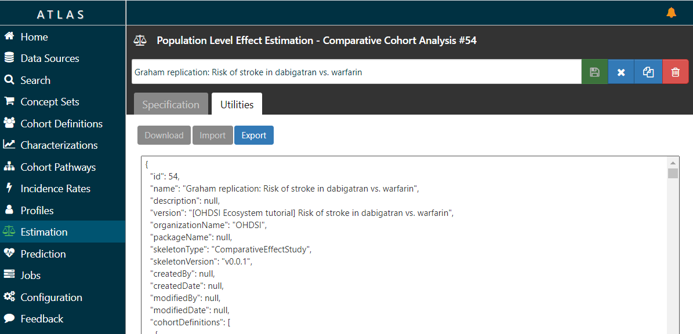

# Introduction

This vignette describes how the Hydra package can be used to create study R packages. The Hydra package contains several *skeletons*, empty R packages which contain the main machinery for executing a study but lack the details of a specific study. Using Hydra, we can hydrate these skeletons to implement a specific study using the study specifications stored in a JSON file. This JSON fully describes the study, including the cohorts that are to be used, as well as the analyses to perform. This JSON input can be created in the OHDSI web-based tool [ATLAS](http://atlas-demo.ohdsi.org/). The output of Hydra is an R package that fully executes the user-defined study, from the data in the Common Data Model all the way to the results which can be viewed in a Shiny app embedded in the study package.

# Obtaining the JSON

The first step is to fully define the study in [ATLAS](http://atlas-demo.ohdsi.org/). This can be an estimation study or a prediction study. Once completed, we need to obtain the JSON. We can obtain the JSON from the Export tab in the Utilities tab, as shown in Figure 1.

```{r atlas, fig.cap='Obtaining the JSON specifications from ATLAS',echo=FALSE, out.width='100%', fig.align='center'}

```

Select all the JSON text (for example using Ctrl-a on Windows), copy it, and paste it into a text file. Save the text file somewhere on your computer, for example as `c:/temp/specs.json`.

# Installing Hydra

To run Hydra, you will need both R and Java to be installed. See the instructions [here](https://ohdsi.github.io/Hades/rSetup.html) for configuring your R environment, including Java.

In R, you can install Hydra using these commands:

```{r eval=FALSE}
install.packages("remotes")
library(remotes)
install_github("ohdsi/Hydra") 
```

# Hydrating the package

We can now use Hydra to generate the study package by hydrating one of the skeletons embedded in Hydra. Note that Hydra automatically selects the appropriate skeleton based on the JSON.

```{r eval=FALSE}
library(Hydra)

specifications <- loadSpecifications("c:/temp/specs.json")

hydrate(specifications = specifications,
        outputFolder = "c:/temp/MyStudyPackage",
        packageName = "StudyPackage")
```

Here we load the JSON specifications file, and feed it into the `hydrate()` function. We specify two additional arguments: The `outputFolder` is the folder where the R package will be created. The `packageName` specifies the name of the R package that will be created.

You can now open the new package, for example in RStudio.
 

